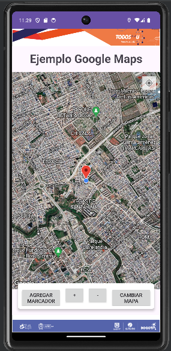
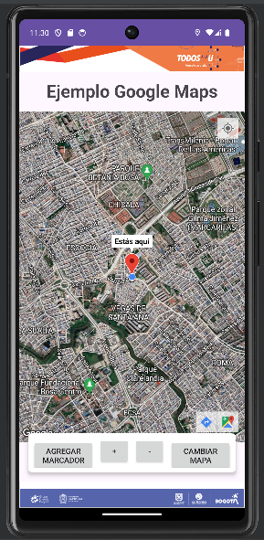
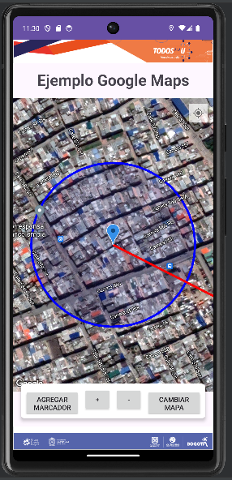
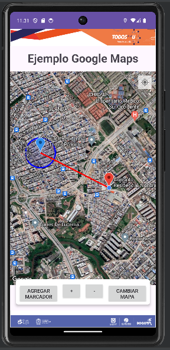
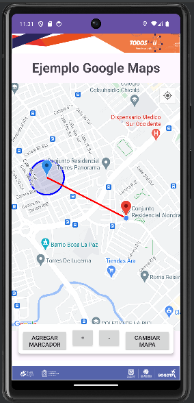
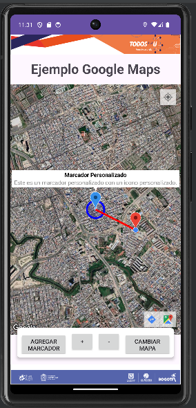

# Ejemplo de Aplicación con Google Maps

Esta es una aplicación de ejemplo que utiliza Google Maps en Android para mostrar la ubicación del usuario y permitir la interacción con el mapa.

## Resumen

La aplicación permite a los usuarios:

- Ver su ubicación actual en el mapa.
- Agregar marcadores personalizados en el mapa.
- Dibujar polilíneas y círculos entre la ubicación del usuario y los marcadores seleccionados.
- Cambiar el tipo de mapa entre normal y satelital.
- Ajustar el zoom del mapa para acercarse o alejarse de la ubicación.

## Funcionalidades

1. **Ubicación Actual**: La aplicación muestra la ubicación actual del usuario en el mapa.

2. **Añadir Marcador Personalizado**: Los usuarios pueden agregar marcadores personalizados en el mapa tocando la pantalla.

3. **Dibujar Líneas y Círculos**: Después de agregar un marcador, se dibuja una línea y un círculo que conectan la ubicación del usuario con el marcador seleccionado.

4. **Cambiar Tipo de Mapa**: Los usuarios pueden cambiar entre los tipos de mapa normal y satelital.

5. **Zoom In y Zoom Out**: Se proporcionan botones para acercar y alejar el mapa para una mejor visualización.

## Capturas de Pantalla

1. Inicio y Permisos de Ubicación
   

2. Aviso de "Estás Aquí" al Presionar un Marcador
   

3. Circulo y Línea entre Ubicación del Usuario y Marcador
   

4. Alejar y Acercar la Ubicación
   

5. Cambiar Diseño del Mapa
   

6. Presionar Marcador Personalizado
   

## Instalación

1. Clona este repositorio o descarga el código fuente.
2. Abre el proyecto en Android Studio.
3. Coloca la API KEY 
4. Conecta un dispositivo Android o utiliza un emulador.
5. Ejecuta la aplicación.

## Contribución

Si encuentras algún problema o tienes alguna sugerencia para mejorar esta aplicación, no dudes en abrir un issue o enviar un pull request.

## Licencia

Este proyecto está licenciado bajo la [Licencia MIT](LICENSE).
